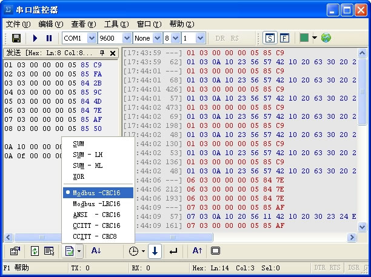

### 简介

BLESerialPort 是一个利用蓝牙实现串口通信的蓝牙调试工具，在缺少硬件的情况下可以方便的使用该软件进行调试。

开发该软件的初衷是解决 App 在开发过程中的调试问题，而当前已有的蓝牙调试软件 LightBlue 不能满足我的需求，Window 下有一款“串口监控器”时候我目前使用过的最好用的串口调试工具，此时就萌生了在 mac 上完成一个使用蓝牙的调试软件。“串口监控器”的界面如下：

### 特性

- [x] 支持自定义 UUID。
- [x] BLE Peripheral 模式。
- [x] 支持条件发送，根据接收内容自定义发送内容。
- [x] 支持循环发送，可选发送当前选定行或自定义发送行范围。
- [x] 支持 ASCII 和 HEX 两种发送模式。
- [ ] 支持自动生成校验位，检验方式包括（SUM、CRC 等）。

### Links

[License MIT](https://github.com/keinYe/BLESerialPort/blob/master/LICENSE)

